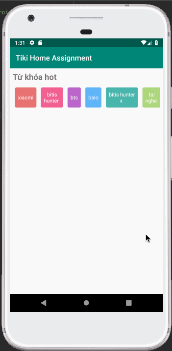

# TikiHomeAssigment
This is a my simple Android. Thank you for reviewing. I hope to receive your feedback soon.

 

Requirement:
 * [x] If the keyword is more than one word, then display in two lines.
 * [x] Background color is random.
 * [x] Keywords can be fetched from the following [link](https://gist.githubusercontent.com/talenguyen/38b790795722e7d7b1b5db051c5786e5/raw/63380022f5f0c9a100f51a1e30887ca494c3326e/keywords.json)
 
More feature: 
 * [x] cache data when app is offline.
